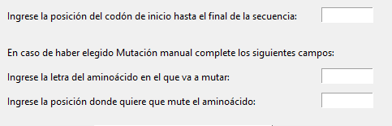
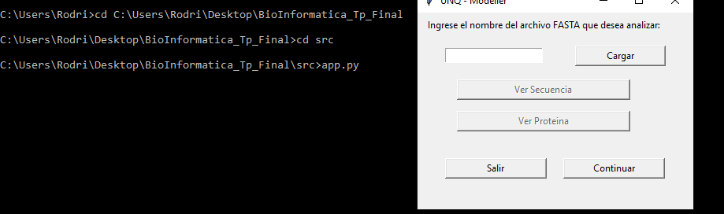

# UNQ Modeller

Unq-Modeller es una aplicación con interfaz gráfica, basada en librerias de python donde el usuario podrá:

  - Obtener la secuencia limpia de un archivo **.fasta**.
  - Ver la proteína obtenida de dicho archivo.
  - Realizar un mutación a elección de la secuencia obtenida.
  - Las mutaciones disponibles son:
        - Mutación Automática: Se elije al azar una posición y una letra a mutar, solo se escoje donde se desea iniciar el flujo de mutación.
        - Mutación Manual: Se elije, letra de aminoácido a mutar, posición donde se desea mutar dicha letra, y también donde se desea iniciar el flujo de mutación.
  - Modelar las proteínas obtenidas.

# *Requisitos:*

- Es necesario tener en cuenta, que para obtener el funcionamiento óptimo de nuestra aplicación, debemos tener todas las librerias y software en nuestro equipo. 
- Nuestra recomendación principal, es utilizar Anaconda, es por ello que mostraremos los métodos de instalación, mediante comandos conda.
- No obstante, se pueden utilizar otos metódos de instalación(ej. Pip)

#### Anaconda
- Instalación:
   - [Enlace a descarga para Windows](https://repo.anaconda.com/archive/Anaconda3-2019.10-Windows-x86_64.exe) 
   - [Enlace a descarga para Linux](https://repo.anaconda.com/archive/Anaconda3-2019.10-Linux-x86_64.sh) 
- Los enlaces son para python 3.7 que es el requerido para nuestra aplicación.

#### Pymol
- Instalación por link:
   - [Enlace a descarga para Windows](https://pymol.org/installers/PyMOL-2.3.3_0-Windows-x86_64.exe) 
   - [Enlace a descarga para Linux](https://pymol.org/installers/PyMOL-2.3.4_121-Linux-x86_64-py37.tar.bz2)

- Instalación conda:
    > $ conda install -c schrodinger pymol
    
#### Modeller 
- Instalación por link:
   - [Enlace a descarga para Windows](https://salilab.org/modeller/9.23/modeller9.23-64bit.exe) 
   - [Enlace a descarga para Linux](https://salilab.org/modeller/9.23/modeller-9.23-1.x86_64.rpm)

- Instalación conda:
    >  $ conda config --add channels salilab
    >  $ conda install modeller

#### BioPython
- Instalación conda:

    >  $ conda install -c anaconda biopython

### lxml
- Instalación conda:
    > $ conda install -c anaconda lxml

# *Información Biologica:*

En UNQ - Modeller se podran elegir parametros con los que la aplicación funcionará, como el tipo de mutación, inicio, letra a mutar, posición de letra a mutar, cantidad de modelos comparativos, etc.

Pero algunos otros parámetros utilizados en nuestra aplicación, ya vienen definidos por default, y el flujo de uso de la misma no permite elección, por este motivo a continuacion se detallarán sus parametros por default:

- **Búsqueda de Blast (NCBIWWW.qblast)**
    > url_base='https://blast.ncbi.nlm.nih.gov/Blast.cgi',
    
    > auto_format=None,
    
    > composition_based_statistics=None,
    
    > db_genetic_code=None,
    
    > endpoints=None,
    
    > entrez_query='(none)',
    
    > expect=10.0, filter=None,
    
    > gapcosts=None,
    
    > genetic_code=None,
    
    > hitlist_size=50,
    
    > i_thresh=None,
   
    > layout=None,
    
    > lcase_mask=None,
    
    >  matrix_name=None,
    
    > nucl_penalty=None,
    
    > nucl_reward=None,
    
    > other_advanced=None,
    
    > perc_ident=None,
    
    > phi_pattern=None,
    
    > query_file=None,
    
    > query_believe_defline=None,
    
    > query_from=None,
    
    > query_to=None,
    
    > searchsp_eff=None,
    
    > service=None,
    
    > threshold=None,
    
    > ungapped_alignment=None,
    
    > word_size=None,
    
    > short_query=None,
    
    > alignments=500,
    
    > alignment_view=None,
    
    > descriptions=500,
    
    > entrez_links_new_window=None,
    
    > expect_low=None,
    
    > expect_high=None,
    
    > format_entrez_query=None,
    
    > format_object=None,
   
    > format_type='XML',
    
    > ncbi_gi=None,
    
    > results_file=None,
    
    > show_overview=None,
    
    > megablast=None,
    
    > template_type=None,
    
    > template_length=None

    > **Observación:** La búsqueda del blast se realiza por porcentaje de identidad, se seleccionará el de mayor porcentaje con menor E value o igual a 0.0. En caso de haber dos o más con los mismos valores se seleccionará el de mayor score.

- **Búsqueda y descarga de PDB (retrieve_pdb_file)**
    > obsolete=False,
    
    > pdir=None,
    
    > file_format=None,
    
    > overwrite=False

    > **Observación:** La búsqueda del pdb se realiza en la base de datos de PDB bank.

- **Búsqueda de clustal (ClustalOmegaCommandline)**
    > verbose=False,
    
    > auto=True,
    
    > force=True

   
- **Modelado**
    > deviation=None,
    
    > library_schedule=None,
    
    > csrfile=None, inifile=None,
    
    > assess_methods= asses.DOPE 

- **Visualización de proteinas**
    > Se abrirán en pymol no alineadas.

 
# *Flujo de uso:*

- **Preparación:**
    > 1- Clonar repositorio.

    > 2- Descargar archivo fasta de [Protein Data Bank](https://www.rcsb.org/).
    
    > 3- Colocar *.fasta* en carpeta principal del repo clonado.
    
- **Uso correcto:**
    > 1- Colorcar nombre de archivo fasta (sin la extension).
    
    > 2- Clickear botón cargar para manipular datos.

    > 
    
    > 3- En caso de ser una secuencia válida y querer visuazlizar la secuencia cargada, o la proteina obtenida, seleccionar los botones respectivos.

    > 

    > 

    > 
    
    > 4- Clickear en continuar.
    
    > 5- Elegir tipo de mutación requerida seleccionando el respectivo botón.

    > 
    
    > 6- Cargar los datos necesarios en los input según elección de mutación.

    > 

    > 
    
    > 7- Cargar datos para manipulación.

    > 
    
    > 8- En caso de ser una mutación exitosa, y querer visualizar la secuencia o proteina resultante, clickear en los respectivos botones.

    > 
    
    > 9- En caso de querer ver los datos manipulados hasta el momento, clickear el botón correspondiente.

    > 
    
    > 10- Ingresar la cantidad de modelos que desea comparar para luego obtener el mejor de ellos, recuerde, cuanto mas modelos mas tiempo de ejecución, pero mejor indice de resultadoy clickear en botón modelar.

    > 
    
    > 11- En el software de pymol que se ejecturá, se podrán colocar comandos de cealing, align o super para poder alinealas.

    Ejemplo: cealign 3LEE, mutacion.B99990002, object=aln
    

- **Errores:**
    > Archivo inexistente: sucede en caso de haber cargado el nombre del archivo fasta vacío, o con un nombre incorrecto.

    > No hay archivo cargado: sucede en caso de querer continuar sin haber cargado un archivo fasta.
    
    > El archivo fasta es incorrecto, hay un stop dentro de la secuencia: sucede en caso de que haya un stop dentro del fasta ingresado por lo cual no es válido el análisis.
    
    > El archivo fasta es una proteína, ingrese una secuencia de ADN o ARN: sucede en caso de haber cargado un fasta de una proteína.
    
    > El tamaño de la secuencia no es el correcto: sucede en caso de ser demasiado pequeña la secuencia obtenida del fasta.
    
    > Debe elegir un tipo de mutación y cargar los campos: sucede en caso de no haber elegido un tipo de mutación o al dejar los campos de inputs sin valores.

- **Archivos Output:**
    > Archivo pdb de la estructura, el cual se llamará **pdb>>nombreProteina<<.ent** , y se guardará en una carpeta nueva creada dentro de la carpeta src, con el nombre de las dos letras del medio del nombre de la proteina. Ejemplo: Si la proteína es 3lee, el archivo generado sera "pdb3lee.ent" , en la carpeta "le".

    > 

    > Archivo fasta, donde estarán ambas proteínas, la original y la mutada, utilizado para luego realizar el alineaminto, la cual se llamará **prot_mut.fasta** (se sobrescribe).

    > 

    > Archivo ali de aliniamiento de las dos proteinas, la original y la mutada; la cual se llamará **prot_mut_>>nombreProteina<<.ali**, y se guardará en la carpeta src del proyecto.

    > 
    
    > Varios pdb de modelado, los cuales tendrán un nombre similar a **mutacion.>>sufijo<<.pdb**, de los cuales se elejirá el mejor para para modelar en pymol. (se sobrescriben).

    > 
    
    > Archivos con extensión .ini, .rsr, .sch los cuales no tienen valor en nuestra app, pero se generan automáticamente con el modelado. (se sobrescriben).

    > 

    > Todos los datos que va generando el modeller se puede observar en consola, no se guardan.
    
    
# *Aclaraciones generales:*    

- Para ejecutar la aplicación de UNQ - modeleer, desde la consola o shell, ubicarse en la carpeta SRC del repositorio clonado, y ejectuar:

    >  $ python3 app.py

    > > 

- En el código, se pueden comentar las siguientes líneas:

    > resultBlast = NCBIWWW.qblast(program= "blastp", database= "pdb", sequence= seq_proteina) [Linea 268]
    
    > save_clk = open(blast, "w") [Linea 271]

    > save_clk.write(resultBlast.read()) [Linea 272] 

    > save_clk.close() [Linea 273]
    
    Dentro de TP_Bioinformatica, esto servirá para cuando reutilizemos búsqueda de Blast que ya tengamos previamente en nuestra carpeta src.
    
- Archivos blast disponibles para pruebas al clonar el repositorio: 
    > CR457033
    
    > 6n5k

    > EU574314
    
# *Contribución:*   

- Rodrigo García

- Cesar Perez

- Marcelo Di Costanzo

- Ana Velez Rueda

   
  
